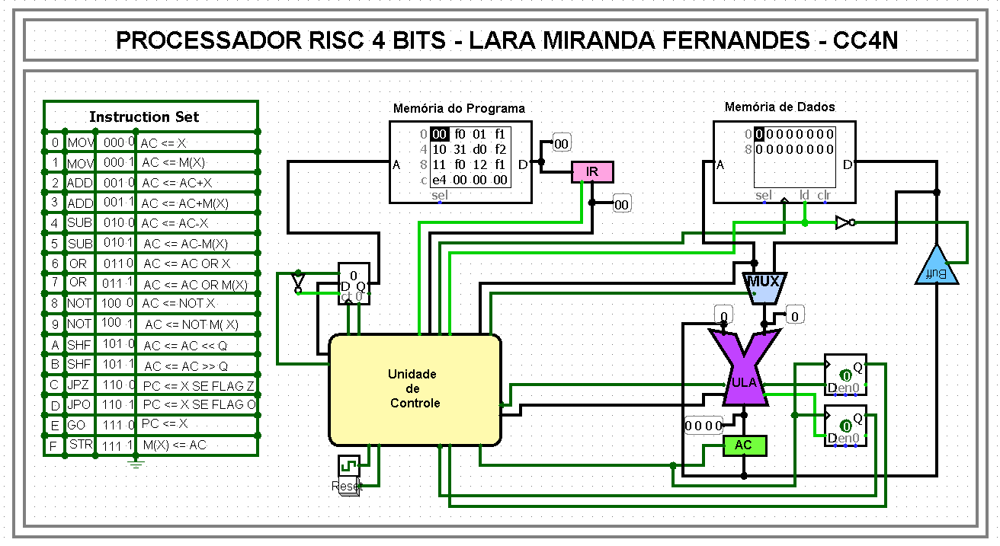

# 🧠 Projeto de Processador

Este repositório contém o desenvolvimento **incremental de um processador**, onde cada upload/commit adiciona ou evolui **um componente específico da arquitetura**.

O objetivo é documentar e versionar todo o processo de construção do processador, desde os blocos mais básicos até a integração final.

  
  
<em>Figura 1: Visão geral do Processador.</em>

## 📌 Objetivo do Projeto

- Projetar um processador do zero
- Implementar cada componente de forma modular
- Facilitar o entendimento da arquitetura por meio de commits bem definidos
- Servir como material de estudo, referência ou base para expansões futuras

## 🧩 Estrutura do Repositório

Cada pasta ou arquivo representa um **componente do processador**.
